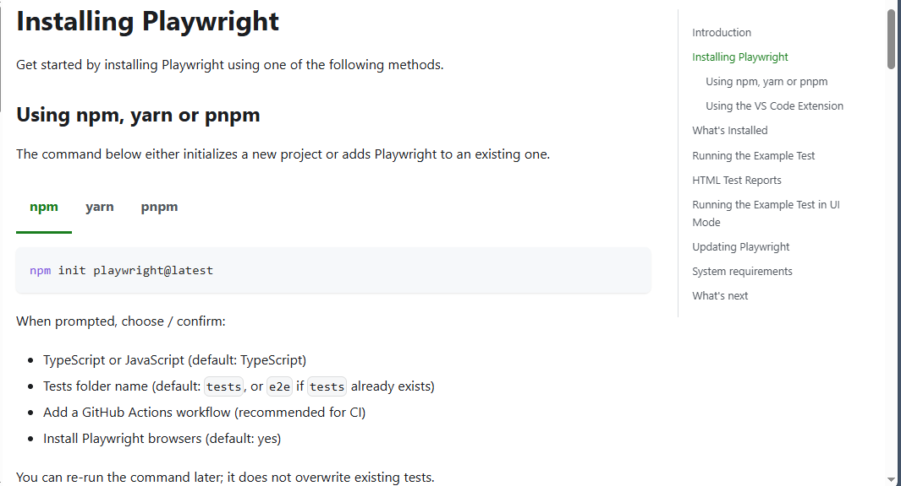
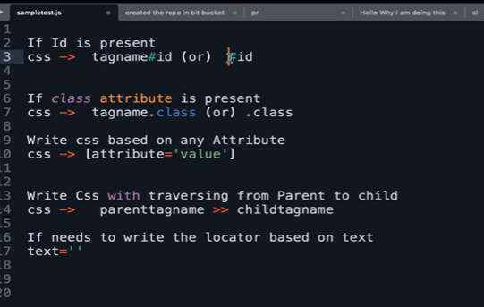

# PlayWright_Practice
This Repo contains all the notes related to playwright and practice sessions using codespaces 
1. Installation & Setup:
 To Get started with playwright as we are focussing on using JavaScript, To execute JavaScript we need to install NodeJS in the the System.

 Note: As i am practicing this session in Github Codespaces, I don't need that installed, because it will be available inbuilt.
 To verify run the following command: node --version

 you can see the latest version -
 @ManvithaAinavolu ➜ /workspaces/PlayWright_Practice (main) $ node --version
v24.14.0

2. To get Started with installing Playwright, you can start a new project by giving the following command in the Terminal.

npm install playwright@latest

For more info, Please refer : https://playwright.dev/docs/intro#installing-playwright

The command will create default libraries and folders with that command.

Explanation of Folder Structure:
1. playwright.config.js: 
Playwright settings file. - where the Tests Run.

Contains:

Browser configuration
Timeout settings
Base URL
Report settings

2. Package.json:
All the Playwright dependencies will be here 
One of the most important files.

Contains:

Project name
Dependencies
Scripts

3. package-lock.json:
Created automatically by npm.

Contains:

Exact versions of installed packages

4. Tests folder :
This is the most important folder.

Contains:

Your test scripts
Automation scenarios

4. node_modules

Contains all downloaded libraries/packages.

Example:

Playwright
Other npm packages

Think of it as:

"Software installed for this project."

# Day1:

So To start working with playwright, to create any test case you should be creating files under tests/ folder.

The Playwright.config.js file is responsible for execute all the test files.

## Day1.spec.js: 
This is the first new test file i am creating, as i am using JavaScript so created the file with .Js extension

## Notes:

1. .js is the general JavaScript file extension for regular code, modules, utilities, scripts, or app logic.
2. .spec.js is a convention used for test files. It indicates the file contains specs/tests for the code, usually run by a test runner like Jest, Mocha, or Playwright.

To declare any varables in Js we use three ways: const,let,var

here we used const to create variable test.

To import any library we have two ways :
1. you can directly import using impirt keyword as given in example.spec.js file
2. if you want to particularly import to a variable you can use require() as given in Day1 file.
The @playwright/test is an annotation contains set of fixtures and methods can be used to perform a test.
### 3.  What is a fixture in Playwright?
A fixture is a reusable setup/helper that provides test state or resources before a test runs, and optionally cleans them up afterward.
### Key points:
Fixtures are defined in Playwright test configuration or using test.extend().
They can provide things like browser pages, API clients, test data, login sessions, or custom utilities.
Playwright injects fixtures into test functions automatically via parameters.

Example: 
test('example', async ({ page }) => { ... })
page is a built-in fixture representing a browser page. (Similarly {browser} in the code.)
You can create custom fixtures to share setup logic across tests.

4. JS is asynchronus.
Asynchronous functions are functions which will not execute in a sequential way rather execute any random order.
5. To prevent that we use async/await keywords in Tests, to execute tests in Sequential order.
6. ()=> is a nameless Anonymous function declaration.

# Progress and trials

- Installed project dependencies using `npm install`.
- Installed Playwright browser dependencies with `npx playwright install-deps` and browser binaries with `npx playwright install`.
- Verified the test file `tests/Day1.spec.js` is valid and ready to run.
- Executed tests in normal headless mode with:
  - `npx playwright test tests/Day1.spec.js --reporter=list`
- Confirmed the tests passed: `6 passed`.
- Tried headed mode, but the Codespace environment does not provide a real visible display, so the browser was not visible.
- Used virtual display tools like `xvfb`/`xvfb-run` to allow headed execution in the container, but the browser still renders to an invisible virtual screen.
- Generated output screenshots in the working directory:
  - `google.png`
  - `google_page.png`

This section tracks the test setup, command trials, and the final successful headless test run.

## Day 3 - 
Tried to run the tests in headless mode, but still i am unable to see the browser.
- revised already done and prepared tests, understood the purpose of them 
- understood the purpose of config.js file - heart of playwright to run the tests.

npx playwright test --> will run the test files from config file driectory path '/tests'

npx playwright test ./tests/Day1.spec.js --> wil run the specific test file.

npx playwright test ./tests/Day1.spec.js --headed --> this will run the playwright is headed mode.

to avoid this for each and everytime we can simply add a headed variable under use{} in config.js file 

use: {
      headless:false,
    viewport:null,
    trace: 'on-first-retry',
  },
  to get the page title of the browser use - page.title()
  understood to use assertions we use expect kewyword.
  ex: expect(await page.title()).toBe("Google");.
  asserts the condition to be true.

  understood the importance of await for every step.

  understood conditional timeout in config.js, by default the timeout is 30seconds. we can overwrite by using expect in config.js
## Day 4:
  ### Locators in Playwright:
  page.locator() -  is to be used to locate a webelement in playwright.
  The method returns an element locator that can be used to perform actions on this page / frame. Locator is resolved to the element immediately before performing an action, so a series of actions on the same locator can in fact be performed on different DOM elements. 

### Note :
 await pauses the async function at that line until the expression (usually a Promise) resolves, then yields the resolved value (or throws if the promise rejects).

### type: 
Types each character in the string into the input, firing input and change events for each keystroke. It is useful for simulating real-user typing behavior.
### fill:
 Clears the existing input value and then inputs the entire string at once without firing individual keystroke events. It is faster and more straightforward when you just need to set a value.

  1. CSS Selector: 
  

  2. xpath selector:
  we can use xpath selector as general inside the page.locator().
  Mostly and generally we use css selectors.

  # Day 5:

  

